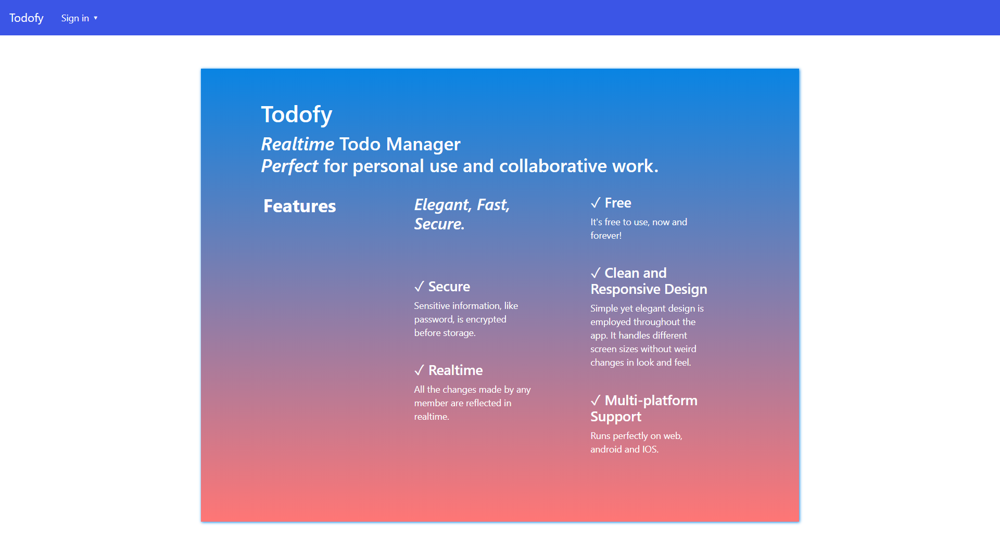
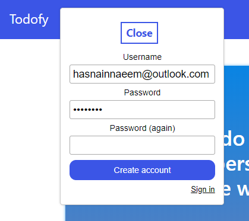
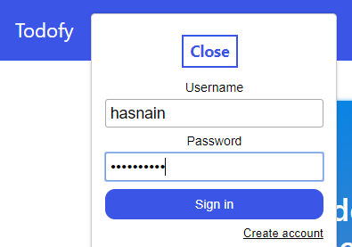
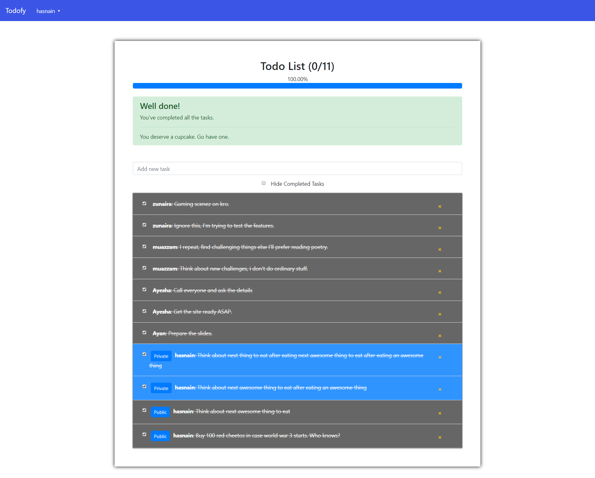

# Todofy - A Meteor & React App
An elegant, reponsive, and simple yet powerful app supporting synchronization of todos across the team. 

## Get Started
* Download chocolatey by following instructions on this page: https://chocolatey.org/install
* Install meteor through chocolatey: `choco install meteor`
* Clone/download this repository
* Move to directory of project and run this command to install the packages `meteor npm install`
* Run command `meteor` to start the app.
* It should work. This app is based on the official Meteor.js tutorial. So, if it doesn't work, go through the instructions on this page (start from react part of 2nd page named `components`): https://www.meteor.com/tutorials/react/creating-an-app
Look for the instructions relevant to state of your PC and execute those. 

## Screenshots
### Home Page

### Sign Up Dialog

### Sign in Dialog

### User Panel/Todo Manager

